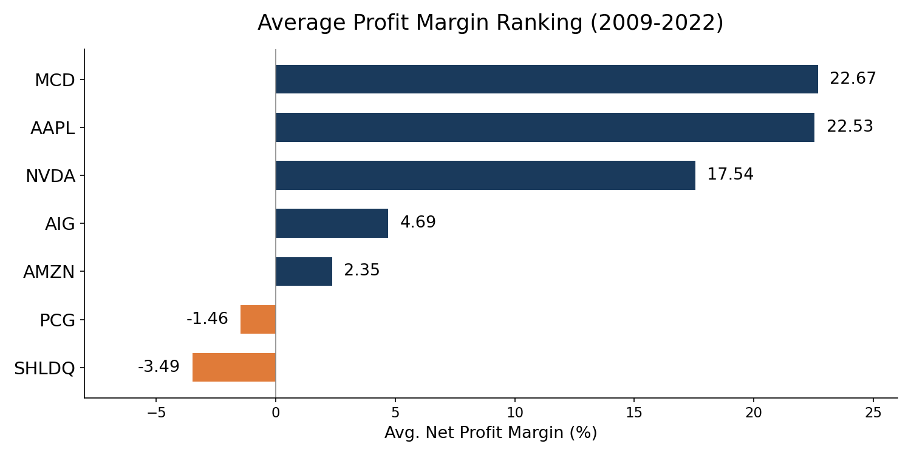
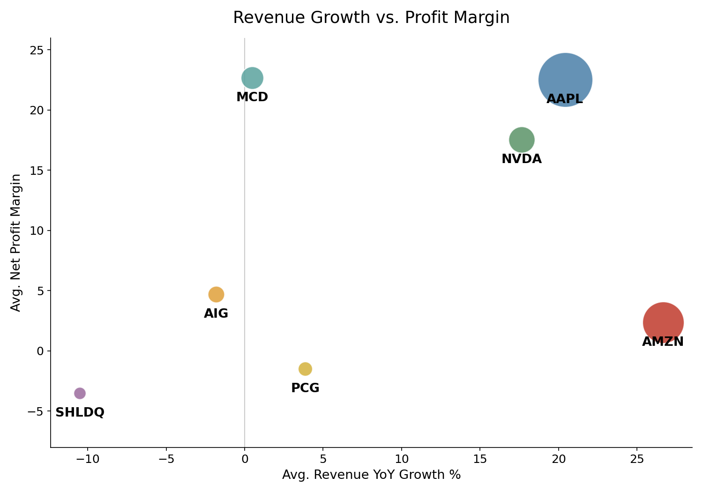
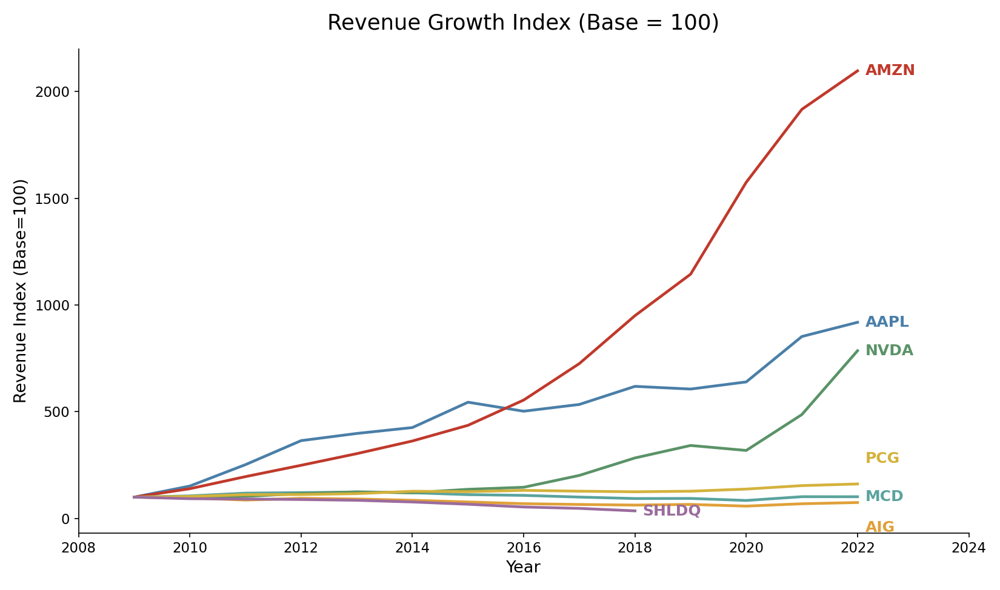
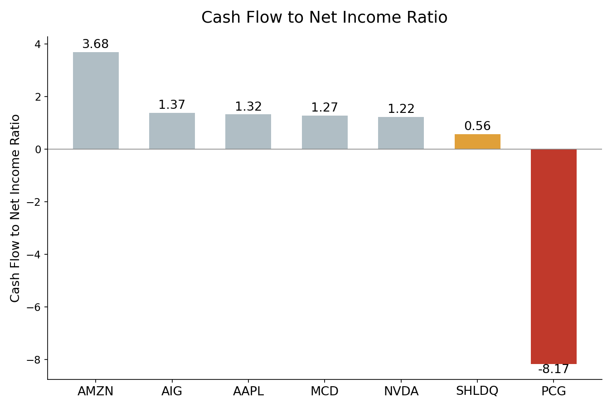
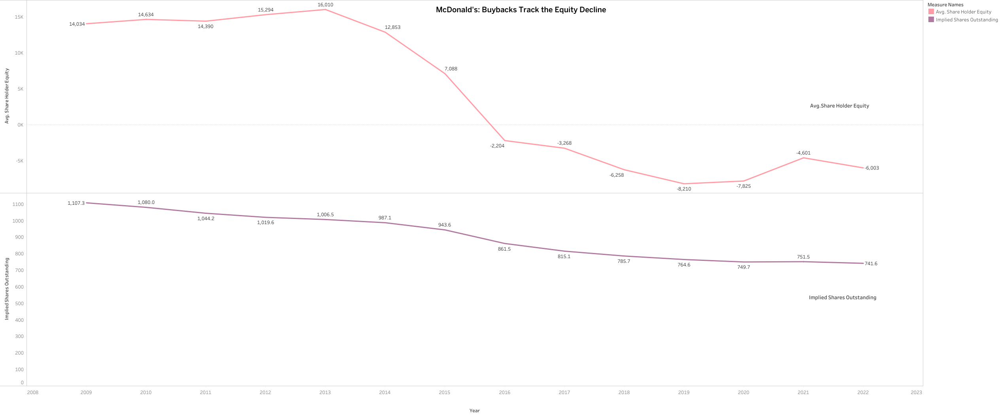
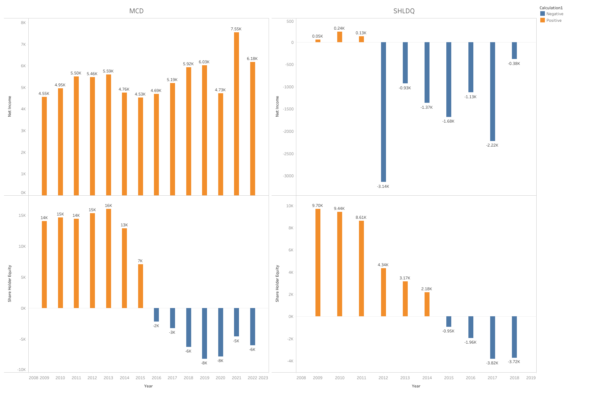
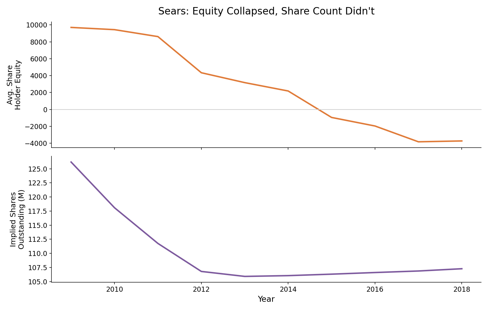
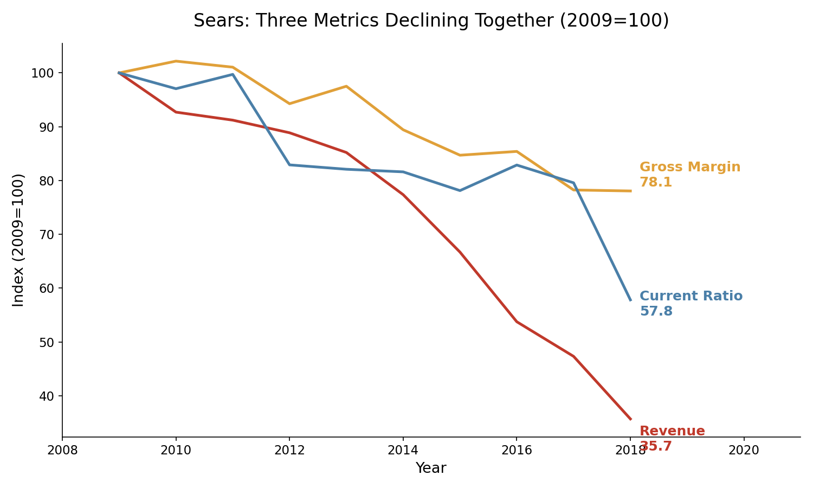
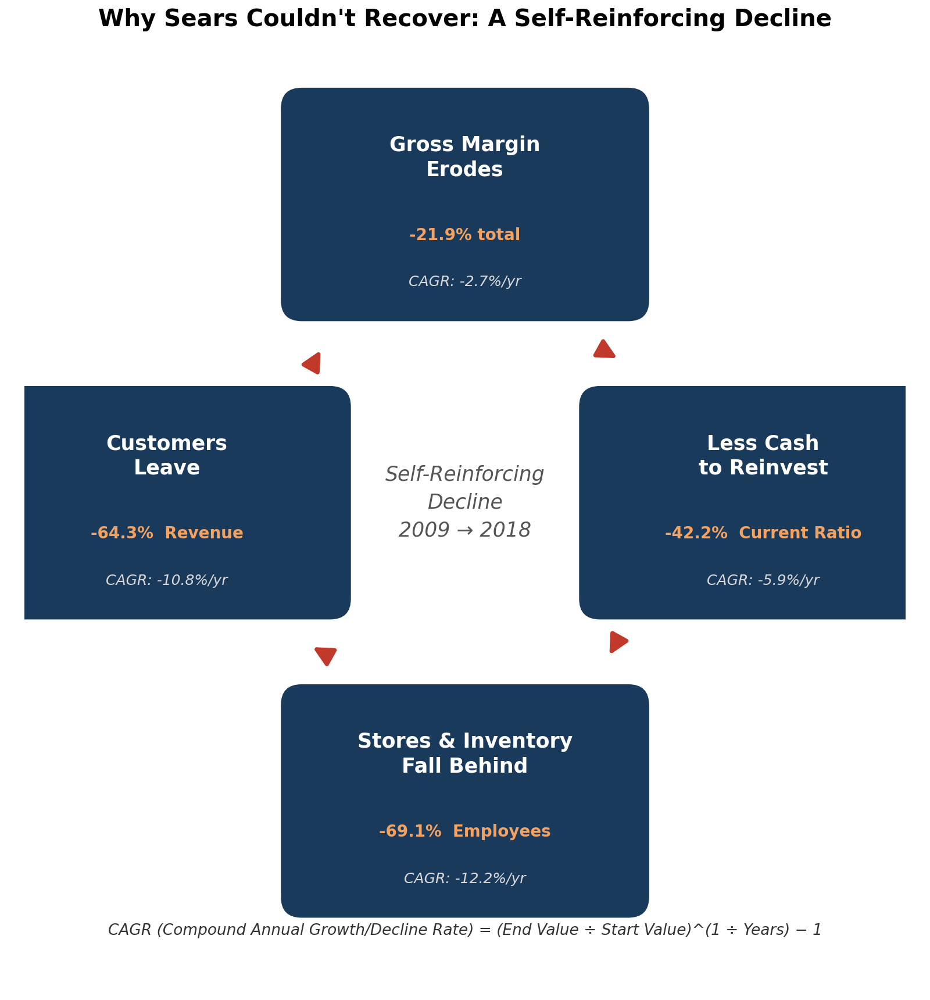
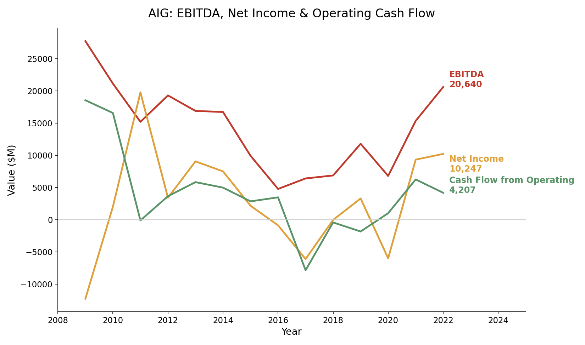

# Reading Between the Numbers: A 14-Year Financial Analysis of 7 Companies

**Data:** Kaggle — Financial Statements of Major Companies (2009–2022, 7 companies)
**Tools:** Tableau, Python (pandas)
**Author:** Kawsar Dilmurat

---

## Executive Summary

Profit margin and revenue growth are the two numbers everyone checks first. This report shows why they aren't enough.

Seven companies, 14 years of financials, three findings — each one built around a number that looked one way on the surface and meant something else underneath:

- **PG&E's -8.17 cash flow ratio** looked like a company in freefall. It was actually a one-time wildfire liability, recognized in 2018–2019, paid in cash a year later.
- **McDonald's negative shareholder equity** looked like financial distress. It was the result of a highly profitable company returning cash to shareholders faster than it earned it.
- **Sears' negative shareholder equity** looked identical to McDonald's on the balance sheet. It came from the opposite cause — years of real losses eating through real capital.
- **AIG's net income** swung from the worst year in this entire dataset to the best in two years, then never stabilized. The swings tracked investment and one-time items, not the insurance business itself.

The pattern across all four stories: the number alone doesn't tell you what happened. Where the cash came from and where it went does.

---

## Business Context

This report covers seven public companies from 2009 to 2022, chosen for how differently their financial stories played out — not because they compete with each other:

| Company | Story |
|---|---|
| Apple (AAPL) | High, stable growth |
| Amazon (AMZN) | Hyper-growth, thin margins |
| Nvidia (NVDA) | Cyclical boom-and-bust |
| McDonald's (MCD) | Mature, defensive, shareholder-focused |
| AIG | Recovery after the 2008 financial crisis |
| PG&E (PCG) | Operational disaster — 2019 wildfire bankruptcy |
| Sears Holdings (SHLDQ) | Structural decline, delisted in 2018 |

The goal isn't to rank them. It's to show that the same metric — margin, growth, equity — can mean opposite things depending on what's driving it.

---

## Section 1: Headline Metrics

**Average profit margin, 2009–2022:**

McDonald's (22.7%) and Apple (22.5%) lead. AIG (4.7%) and Amazon (2.4%) sit in the middle. PG&E (-1.5%) and Sears (-3.5%) are negative.

**Growth against margin:**

Amazon has the highest average revenue growth in the group (26.7%/yr) paired with one of the lowest margins. McDonald's is the opposite: the best margin, almost no growth (0.5%/yr).

These two charts are a snapshot. They don't say how each company got here, or whether a number reflects an ongoing pattern or one unusual year. The rest of this report answers that.

---

## Section 2: Growth Trajectories, 2009–2022

Indexing each company's revenue to its own starting year (2009 = 100) separates four distinct trajectories:

- **Amazon and Nvidia** — compounding growth, accelerating over time
- **Apple** — steady, strong growth with no major reversals
- **McDonald's and AIG** — roughly flat for 14 years
- **PG&E** — a sharp dip around the 2019 bankruptcy, then recovery
- **Sears** — decline in every single year, ending near zero at delisting

The shape of decline matters. PG&E's dip is a V. Sears' is a straight line down. That difference is the subject of Finding 3.

---

## Finding 1: PG&E — When a Bad Number Isn't What It Looks Like

PG&E's cash-flow-to-net-income ratio is **-8.17** — the only negative number in the group, and by a wide margin. On its own, this reads as a company burning cash while losing money.

The year-by-year numbers say something different:

| Year | Net Income | Cash Flow from Operating |
|---|---|---|
| 2017 | 1,646 | 5,977 |
| 2018 | -6,851 | 4,752 |
| 2019 | -7,656 | 4,816 |
| 2020 | -1,318 | -19,130 |
| 2021 | -102 | 2,262 |
| 2022 | 1,800 | 3,721 |

In 2018–2019, net income collapsed because PG&E recognized a wildfire liability on paper — an accounting entry, not a cash outflow. Operating cash flow barely moved. In 2020, the cash actually went out the door (operating cash flow fell to -19,130), by which point net income had already started to recover.

The -8.17 ratio isn't ongoing decline. It's two different events — a liability booked in one year, paid in cash the next — landing in the same average.

**Why it matters:** a ratio built from an average can hide the fact that the two numbers going into it never moved together in the first place.

---

## Finding 2: McDonald's vs. Sears — Same Signal, Opposite Cause

McDonald's and Sears both show negative shareholder equity on their balance sheets. Read as a single ratio, they look the same. The cause is opposite — and for McDonald's, the mechanism can be verified directly from the data.

**McDonald's:** equity went negative in 2016 and stayed there, while net income kept climbing every year through 2022:

| Year | Net Income | Shareholder Equity |
|---|---|---|
| 2014 | 4,758 | 12,853 |
| 2016 | 4,687 | -2,204 |
| 2018 | 5,924 | -6,258 |
| 2022 | 6,177 | -6,003 |

A rising, profitable company shouldn't see its equity collapse. The dataset has no line item called "buybacks," but Net Income ÷ EPS backs out the implied share count for each year — and that number tells the story:

| Year | Implied Shares Outstanding (M) |
|---|---|
| 2009 | 1,107 |
| 2013 | 1,006 |
| 2016 | 861 |
| 2019 | 765 |
| 2022 | 742 |

Share count fell 33% over 14 years. More importantly, the pace lines up with the equity collapse: shares fell fastest (-14.4%, then -11.2%) in 2013–2019, exactly when equity crashed from +16,010 to -8,210. Once equity leveled off after 2019, the pace of share reduction slowed to -3.0%. The timing match is the evidence — this isn't a coincidence of two unrelated numbers moving down at the same time.

Apple shows the same mechanism earlier in its lifecycle: shareholder equity fell from 134,047 (2017) to 50,672 (2022) while net income hit an all-time high. Same direction, different stage.

**Sears:** equity went negative in 2015 — one year earlier than McDonald's — for the opposite reason. Sears lost money every year from 2013 onward, and those losses ate directly into the capital it had left:

| Year | Net Income | Shareholder Equity |
|---|---|---|
| 2013 | -930 | 3,172 |
| 2015 | -1,682 | -945 |
| 2017 | -2,221 | -3,824 |
| 2018 | -383 | -3,723 |

One company had money to spare and retired its own stock. The other ran out of money it needed.

The same check applied to McDonald's rules out buybacks as Sears' explanation. Sears' implied share count — the same Net Income ÷ EPS calculation — barely moved for a decade:

| Year | Implied Shares Outstanding (M) |
|---|---|
| 2009 | 126.2 |
| 2012 | 106.8 |
| 2015 | 106.3 |
| 2018 | 107.3 |

Share count stayed flat within half a million shares while equity fell from +9,699 to -3,723. If Sears' equity had collapsed the way McDonald's did, share count would have fallen too. It didn't — which confirms the decline came from losses, not from any deliberate return of capital.

**Three metrics failing at once (Sears)**

Indexed to 2009 = 100, three independent measures — revenue, gross margin, and current ratio — all decline together:

- **Revenue:** down to 35.7 (2018) — the company sold less every year
- **Gross margin:** down to 78.1 — it also earned less profit per item sold
- **Current ratio:** down to 57.8, crossing below 1.0 — it lost the ability to cover short-term bills

None of these three had to move together. That they did is the real finding.

**Why they moved together**

The three metrics reinforce each other in a loop: thinner margins left less cash to reinvest in stores and inventory, which drove customers away, which further eroded margin. Each stage's CAGR is shown above — inventory and staffing (-12.2%/yr) declined fastest, revenue (-10.8%/yr) close behind.

This is also what separates Sears from PG&E. Both show a delay between when a number worsens and when it fully shows up elsewhere. At PG&E, the delay was accounting timing — one event, recognized early. At Sears, the delay was a financial cushion being spent down, year after year, with no single event to point to.

**Why it matters:** the same balance-sheet signal — negative equity — can come from a company giving away more cash than it needs, or a company running out of cash it needed to survive. Checking the same derived number (implied share count) against both companies did double duty here: it confirmed the mechanism for McDonald's and ruled it out for Sears, using the same test both times.

---

## Finding 3: AIG — Profit Swings the Business Didn't Cause

AIG went from the single worst year in this dataset (-12,244 net income, 2009) to one of the best (+19,810, 2011) in two years. It never fully settled after that, swinging between profit and loss for the next decade.

The EBITDA line explains why. EBITDA is a rough proxy for how the core business is actually performing. In 2011, EBITDA was *lower* than the year before (15,225 vs. 21,166) — the underlying business hadn't improved — yet net income jumped nearly tenfold.

The cash flow number makes the disconnect impossible to miss: in that same year, 2011, AIG's cash flow from operating activities was **-81** — essentially zero. AIG's books showed a $19,810 profit backed by almost no actual cash collected from running the business.

When net income moves opposite to EBITDA, and operating cash flow doesn't move at all, something below the operating line is driving the result: investment gains, reserve releases, one-time charges. For an insurer like AIG, that's exactly where the volatility tends to sit — not in how much insurance it sold, but in how its investment portfolio and legacy liabilities performed in a given year.

**Why it matters:** net income assumes a business with one consistent driver. For a company where non-operating items regularly swing larger than operating profit — and where the cash flow statement shows none of the profit actually landing as cash — net income measures something closer to "how the year went" than "how the business is doing."

---

## Recommendations: A Diagnostic Framework

Margin and growth rank companies by outcome. They don't say why the outcome happened. Every finding in this report came from the same move: stop at the metric that looks unusual, then check it against a second, independent number before drawing a conclusion. That move generalizes into a checklist:

| Signal | Don't conclude immediately | Check next |
|---|---|---|
| Negative shareholder equity | Not automatically distress | Is net income rising or falling? Is implied share count falling (buybacks) or flat (losses eating capital)? |
| Net income deeply negative in a specific year | Not necessarily an operating collapse | Does operating cash flow move the same year, or a year later? |
| Net income and EBITDA move in opposite directions | Net income isn't tracking the core business | Does operating cash flow confirm which one is closer to reality? |
| High revenue growth paired with thin margin | Not automatically unhealthy | Is the company reinvesting for scale (Amazon) or simply unable to convert revenue to profit? |
| Revenue, margin, and liquidity all declining together | A single bad ratio can be a one-off; three moving together usually isn't | Is there a mechanism connecting them (e.g., thinner margins → less cash → underinvestment → fewer customers)? |

The companies in this report each landed in a different place once traced through:

- **PG&E** — cash was consumed by a liability it didn't choose (wildfire settlement), recognized on paper a year before it hit cash
- **Sears** — cash was never there to begin with; losses ate through it every year, with no single event to point to
- **McDonald's** — cash was returned to shareholders by choice, fast enough to run equity negative despite rising profit
- **AIG** — the profit itself wasn't backed by cash in the first place; a $19,810 gain in 2011 came with operating cash flow of -81

Four different mechanisms, one shared lesson: the metric is a starting point for a question, not an answer by itself.

---

## Limitations

- **NVDA has 15 years of data (2009–2023)**; every other company in this dataset has 14 (2009–2022). Comparisons involving NVDA's most recent year are not on equal footing with the rest.
- **Sears (SHLDQ) ends in 2018** — the year before delisting. This is the company's full lifespan in the dataset, not missing data.
- **PG&E's 2019 Debt/Equity ratio reads as 0.00**, which is very likely a data artifact of Chapter 11 reclassification (debt becomes "liabilities subject to compromise" during bankruptcy) rather than an actual zero-debt year.
- **The employee-productivity comparison (Finding 2, early drafts) uses each company's full-period average**, not a single shared year, because Sears and PG&E don't share a common "current" year with the rest of the group.
- **McDonald's implied share count (Net Income ÷ EPS) assumes the dataset's EPS is basic, not diluted.** The two typically differ by a small margin; the 33% decline over 14 years is large enough that this doesn't change the conclusion, but the exact year-by-year figures carry that uncertainty.

---

## Data & Code

- `data/financial_statements_cleaned.csv` — the cleaned dataset used throughout this report.
- `scripts/derived_metrics.py` — every calculated figure in this report that isn't a raw column (CAGR, implied shares outstanding, indexed metrics, etc.), runnable end-to-end against the cleaned data.
- `scripts/data_cleaning.py` — documents how the raw dataset was cleaned. Reconstructed from project notes, not tested against the original raw file (see script docstring).
