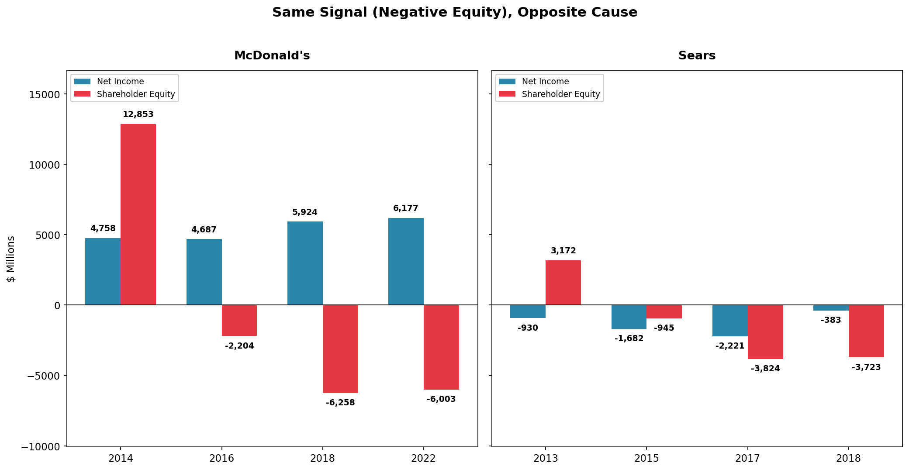
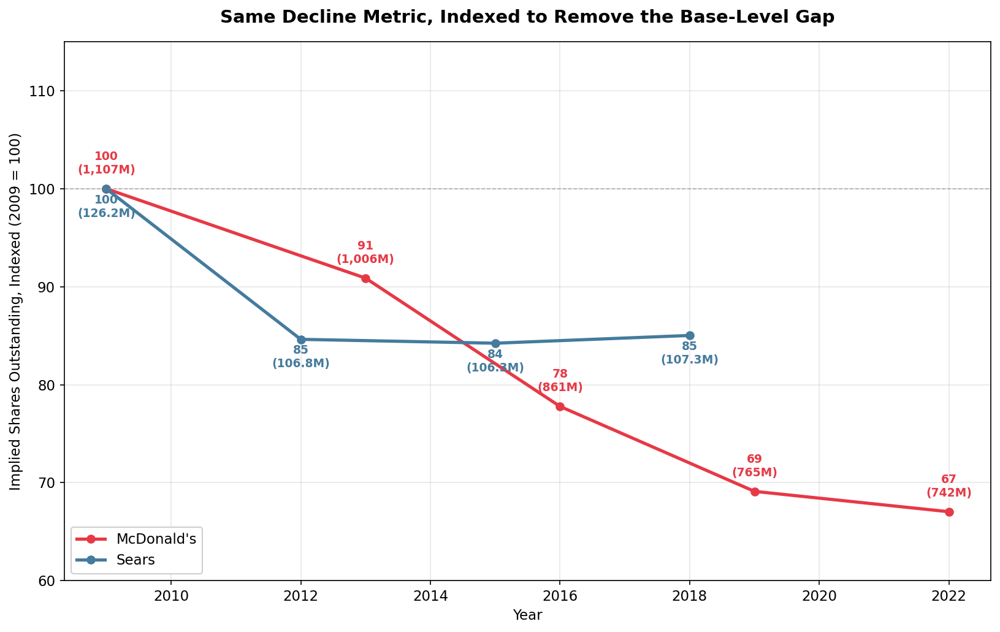

# Reading Between the Numbers: A 14-Year Financial Analysis of 7 Companies

> **TL;DR:**
> - A ratio built from an average can hide two unrelated events that happened in different years.
> - Negative shareholder equity can mean "the company is failing" **or** "the company is so profitable it's buying back its own stock." Same balance-sheet signal, opposite cause — and the same test (implied share count) can prove which one it is, for both companies at once.
> - Three independent metrics declining together is a much stronger signal than any single bad number.
> - Rising profit doesn't always mean the business improved — sometimes something *outside* the core business did the work, and the cash flow statement is what exposes that.
> - **The one skill this report demonstrates: don't stop at the number that looks unusual — check it against a second, independent number before drawing a conclusion.**

**Data:** Kaggle — Financial Statements of Major Companies (2009–2022, 7 companies)
**Tools:** Tableau, Python (pandas)
**Author:** Kawsar Dilmurat

**Units:** all dollar figures below are **$ millions** unless noted otherwise. Market Cap is in **$ billions** (as labeled in the source dataset). Per-share figures (EPS, Implied Shares Outstanding) are labeled individually.

---

## Executive Summary

Profit margin and revenue growth are the two numbers everyone checks first. This report shows why they aren't enough.

**Three findings, one shared pattern:**

| Company | The number that looks bad/good | What it actually was |
|---|---|---|
| **PG&E** | Cash flow ratio of **-8.17** — looks like freefall | A one-time wildfire liability, booked in 2018–19, paid in cash a year later |
| **McDonald's** | Negative shareholder equity — looks like distress | A hugely profitable company buying back its own stock faster than it earns |
| **Sears** | Negative shareholder equity — looks identical to McDonald's | The opposite cause: years of real losses eating through real capital |
| **AIG** | Net income swung from the worst year in the whole dataset to AIG's own best year, in 2 years | The 2011 spike specifically tracked a record year of investing cash flow, not insurance operations |

**The pattern across all four companies: the number alone doesn't tell you what happened. Where the cash came from and where it went does.**

---

## Business Context

**Key point:** these 7 companies aren't competitors. They're picked because their 14-year stories look completely different from each other.

| Company | Story |
|---|---|
| Apple (AAPL) | High, stable growth |
| Amazon (AMZN) | Hyper-growth, thin margins |
| Nvidia (NVDA) | Cyclical boom-and-bust |
| McDonald's (MCD) | Mature, defensive, shareholder-focused |
| AIG | Recovery after the 2008 financial crisis |
| PG&E (PCG) | Operational disaster — 2019 wildfire bankruptcy |
| Sears Holdings (SHLDQ) | Structural decline, delisted in 2018 |

The goal isn't to rank them. It's to show that the same metric — margin, growth, equity — can mean opposite things depending on what's driving it.

---

## Section 1: Headline Metrics (the surface-level view)

**Key point:** these two charts are a snapshot only — they show *what* happened, not *why*. Everything after this section explains the "why."

- McDonald's (22.7%) and Apple (22.5%) lead on average profit margin.
- AIG (4.7%) and Amazon (2.4%) sit in the middle.
- PG&E (-1.5%) and Sears (-3.5%) are negative.

- Amazon has the highest average revenue growth in the group (26.7%/yr), paired with one of the lowest margins.
- McDonald's is the opposite: the best margin, almost no growth (0.5%/yr).

---

## Section 2: Growth Trajectories, 2009–2022

**Key point:** revenue and profit don't always move together — PG&E's revenue barely moved through its 2018–2019 crisis even as net income collapsed (see Finding 1). The shape of a revenue trajectory alone can hide as much as it reveals.

Indexing each company's revenue to its own starting year (2009 = 100) separates several distinct trajectories:

- **Amazon** — compounding growth, accelerating throughout, ending 21x its 2009 revenue
- **Nvidia** — real growth overall, but cyclical, not smooth: revenue dipped in 2010, again in 2014, and fell sharply in 2020 (to 319, down from 342 the year before) before rebounding
- **Apple** — strong growth overall (9x by 2022), with two modest dips (2016, 2019) rather than a straight climb
- **McDonald's** — roughly flat for 14 years, oscillating between 84 and 124 and ending near its 2009 level
- **AIG** — a sustained decline, not flat: down to a low of 58 in 2020 before a partial recovery to 75 by 2022
- **PG&E** — steady, unremarkable growth throughout, including through the 2019 bankruptcy year — revenue never reflects the crisis that shows up in net income (Finding 1)
- **Sears** — decline in every single year, ending near zero at delisting

---

## Finding 1: PG&E — When a Bad Number Isn't What It Looks Like

PG&E's account shows one year where it *owed* money (booked on paper, no cash moved) and a separate year where it *paid* that money (cash actually left). Averaged into one ratio, two different events look like one ongoing crisis.

- PG&E's cash-flow-to-net-income ratio is **-8.17** — the only negative number in the group, by a wide margin.
- On its own, this reads as: *a company burning cash while losing money.*
- The year-by-year numbers say something different:

| Year | Net Income ($M) | Cash Flow from Operating ($M) |
|---|---|---|
| 2017 | 1,646 | 5,977 |
| 2018 | -6,851 | 4,752 |
| 2019 | -7,656 | 4,816 |
| 2020 | -1,318 | -19,130 |

See all 14 years (used to compute the -8.17 average)

| Year | Net Income ($M) | Cash Flow from Operating ($M) |
|---|---|---|
| 2009 | 1,220 | 3,039 |
| 2010 | 1,099 | 3,206 |
| 2011 | 844 | 3,739 |
| 2012 | 816 | 4,882 |
| 2013 | 814 | 3,427 |
| 2014 | 1,436 | 3,690 |
| 2015 | 874 | 3,780 |
| 2016 | 1,393 | 4,409 |
| 2017 | 1,646 | 5,977 |
| 2018 | -6,851 | 4,752 |
| 2019 | -7,656 | 4,816 |
| 2020 | -1,318 | -19,130 |
| 2021 | -102 | 2,262 |
| 2022 | 1,800 | 3,721 |

The -8.17 ratio is the average Cash Flow from Operating ÷ average Net Income across all 14 years above — not a single year's ratio.

- **2018–2019:** net income collapsed because PG&E recognized a wildfire liability on paper — an accounting entry, not a cash outflow. Operating cash flow barely moved.
- **2020:** the cash actually went out the door (operating cash flow fell to -19,130) — by which point net income had already started to recover.

**Why it matters:** a ratio built from an average can hide the fact that the two numbers going into it never moved together in the first place.

---

## Finding 2: McDonald's vs. Sears — Same Signal, Opposite Cause

Both companies' equity went negative. One went negative because it's *so profitable* it keeps buying back its own stock. The other went negative because it kept *losing money* until there was nothing left — and the same math that proves the first story also rules it out for the second.

McDonald's and Sears both show negative shareholder equity on their balance sheets. Read as a single ratio, they look the same. The chart below puts both companies on the same scale — the cause is opposite, and it's visible immediately:

**McDonald's — profitable, shrinking on paper by choice:**

Equity went negative in 2016 and stayed negative through 2022, even as net income stayed solidly profitable across the same years — including a new high in 2021:

| Year | Net Income ($M) | Shareholder Equity ($M) |
|---|---|---|
| 2013 | 5,586 | 16,010 |
| 2014 | 4,758 | 12,853 |
| 2015 | 4,529 | 7,088 |
| 2016 | 4,686 | -2,204 |
| 2017 | 5,192 | -3,268 |
| 2018 | 5,924 | -6,258 |
| 2019 | 6,025 | -8,210 |
| 2020 | 4,730 | -7,825 |
| 2021 | 7,545 | -4,601 |
| 2022 | 6,177 | -6,003 |

Net income wasn't perfectly smooth — it dipped in 2020 (a pandemic year across the dataset) and again in 2022 relative to 2021's high — but it never came close to loss territory, while equity spent all seven of these years underwater. A company with a genuine operating problem doesn't usually keep posting profits like these.

See all 14 years

| Year | Net Income ($M) | Shareholder Equity ($M) |
|---|---|---|
| 2009 | 4,551 | 14,034 |
| 2010 | 4,946 | 14,634 |
| 2011 | 5,503 | 14,390 |
| 2012 | 5,465 | 15,294 |
| 2013 | 5,586 | 16,010 |
| 2014 | 4,758 | 12,853 |
| 2015 | 4,529 | 7,088 |
| 2016 | 4,686 | -2,204 |
| 2017 | 5,192 | -3,268 |
| 2018 | 5,924 | -6,258 |
| 2019 | 6,025 | -8,210 |
| 2020 | 4,730 | -7,825 |
| 2021 | 7,545 | -4,601 |
| 2022 | 6,177 | -6,003 |

- A rising, profitable company shouldn't see its equity collapse.
- **The dataset has no line item called "buybacks."** So: Net Income ÷ EPS backs out the implied share count for each year.

**Sears — the opposite mechanism:**

Equity went negative in 2015 — one year earlier than McDonald's — for the opposite reason. Sears lost money every year from 2013 onward, and those losses ate directly into the capital it had left:

| Year | Net Income ($M) | Shareholder Equity ($M) |
|---|---|---|
| 2009 | 53 | 9,699 |
| … | … | … |
| 2013 | -930 | 3,172 |
| 2014 | -1,365 | 2,183 |
| 2015 | -1,682 | -945 |
| 2016 | -1,129 | -1,956 |
| 2017 | -2,221 | -3,824 |
| 2018 | -383 | -3,723 |

See all 10 years (Sears' full lifespan in this dataset)

| Year | Net Income ($M) | Shareholder Equity ($M) |
|---|---|---|
| 2009 | 53 | 9,699 |
| 2010 | 235 | 9,435 |
| 2011 | 133 | 8,614 |
| 2012 | -3,140 | 4,341 |
| 2013 | -930 | 3,172 |
| 2014 | -1,365 | 2,183 |
| 2015 | -1,682 | -945 |
| 2016 | -1,129 | -1,956 |
| 2017 | -2,221 | -3,824 |
| 2018 | -383 | -3,723 |

**One company had money to spare and retired its own stock. The other ran out of money it needed.**

**The check that closes the loop:** the same test used to prove the McDonald's story can also be used to rule out that same story for Sears. The chart below indexes both companies' implied share count to 2009 = 100, removing the gap in base size (McDonald's starts near 1,100M shares, Sears near 126M) so only the *rate of decline* is being compared:

- **McDonald's:** share count fell 33% over 14 years — and the pace lines up with the equity collapse. The decline came in two clustered bursts, not evenly: -14.4% across 2013–2016, then another -11.2% across 2016–2019 — exactly the years equity crashed from +16,010 (2013) to -8,210 (2019) — both figures visible in the table above. Once equity leveled off after 2019, share reduction slowed sharply, down just -3.0% across 2019–2022. The timing match is the evidence — not a coincidence of two unrelated numbers moving down at the same time.
- **Sears:** share count fell 15% by 2012, then stayed flat — within half a million shares — for the rest of the dataset, while equity collapsed from +9,699 (2009) to -3,723 (2018) — both figures visible in the table above. If Sears' equity had collapsed the way McDonald's did, share count would have kept falling too. It didn't. That confirms the decline came from losses, not from any deliberate return of capital.

**Three metrics failing at once (Sears):**

Indexed to 2009 = 100, three *independent* measures decline together:

- **Revenue:** down to 35.7 (2018) — the company sold less every year
- **Gross margin:** down to 78.1 — it also earned less profit per item sold
- **Current ratio:** down to 57.8, crossing below 1.0 — it lost the ability to cover short-term bills

**None of these three had to move together. That they did is the real finding.**

**Why they moved together:**

- These three aren't independent. Revenue and gross margin are both about how much money comes in from sales; the current ratio measures how much cash and short-term assets are on hand to cover near-term bills. A company that's selling less (revenue down) at worse margins (gross margin down) is, almost by construction, going to have less cash on hand over time — which is exactly what the current ratio dropping below 1.0 shows. This isn't three unrelated problems; it's one shrinking cash position, visible in three different line items at once.
- Employee headcount declined fastest (-12.2%/yr), revenue close behind (-10.8%/yr) — Sears cut staff from 291,000 (2009) to 89,900 (2018) while revenue fell from 46,770 to 16,702.

**How this differs from PG&E:** both show a delay between when a number worsens and when it fully shows up elsewhere. At PG&E, the delay was accounting timing — one event, recognized early. At Sears, the delay was a financial cushion being spent down, year after year, with no single event to point to.

**Why it matters:** the same balance-sheet signal — negative equity — can come from a company giving away more cash than it needs, or a company running out of cash it needed to survive. Checking the same derived number (implied share count) against both companies did double duty here: it confirmed the mechanism for McDonald's and ruled it out for Sears, using the same test both times.

---

## Finding 3: AIG — Profit Swings the Business Didn't Cause

AIG's profit jumped nearly 10x in one year, but the number that tracks the core insurance business went *down* that same year — and almost none of the "profit" showed up as real cash.

| Year | Net Income ($M) | EBITDA ($M) | Cash Flow from Operating ($M) | Cash Flow from Investing ($M) |
|---|---|---|---|---|
| 2009 | -12,244 | 27,765 | 18,584 | 5,778 |
| 2010 | 2,046 | 21,166 | 16,597 | -9,912 |
| 2011 | 19,810 | 15,225 | -81 | 36,448 |
| 2012 | 3,438 | 19,327 | 3,676 | 16,612 |
| 2013 | 9,085 | 16,922 | 5,865 | 7,099 |
| 2014 | 7,529 | 16,752 | 5,007 | 14,284 |
| 2015 | 2,196 | 9,958 | 2,877 | 8,462 |
| 2016 | -849 | 4,805 | 3,502 | 3,252 |
| 2017 | -6,084 | 6,435 | -7,818 | 14,041 |
| 2018 | -6 | 6,897 | -394 | -223 |
| 2019 | 3,326 | 11,817 | -1,807 | -5,475 |
| 2020 | -5,973 | 6,821 | 1,038 | -6,202 |
| 2021 | 9,359 | 15,382 | 6,279 | -3,280 |
| 2022 | 10,247 | 20,640 | 4,207 | -3,626 |

- AIG went from the **single worst year in this entire 95-row dataset** — any company, any year — (-12,244 net income, 2009) to **its own best year on record** (+19,810, 2011), in just two years. It didn't stabilize after that either — net income kept swinging between profit and loss through 2022.
- **EBITDA — a rough proxy for how the core business is actually performing — was *lower* in 2011 than the year before** (15,225 vs. 21,166). The underlying business hadn't improved. Yet net income jumped nearly tenfold.
- **The cash flow number makes the disconnect impossible to miss:** in that same year, AIG's cash flow from operating activities was **-81** — essentially zero. AIG's books showed a $19,810 profit backed by almost no actual cash collected from running the business.

2011 isn't a one-off. Comparing year-over-year changes across the full dataset, net income and EBITDA moved in **opposite directions in 5 of the last 13 years** — including four years in a row, 2010 through 2013, where every single year they disagreed. When two metrics that are supposed to move together instead diverge this often, something outside of EBITDA's scope is regularly driving net income, in both directions.

2011 is also the only year in the entire dataset where **net income actually exceeds EBITDA** (19,810 vs. 15,225) — since EBITDA adds back interest, taxes, depreciation, and amortization on top of operating profit, net income beating it at all is unusual, and it happens nowhere else in these 14 years. That same year, AIG's Cash Flow from Investing was **36,448** — more than double the next-highest year (16,612, in 2012) and by far the largest investing cash flow in the dataset. The one year net income broke the normal pattern is the same year investing activity spiked to an outlier level. That's a real, checkable link, not a guess.

**Why it matters:** net income assumes a business with one consistent driver. In 2011, both the composition of that year's profit (beating EBITDA, which almost never happens) and a matching spike in investing cash flow point to the same non-operating source. Net income that year measured "how the investing side of the business went," not "how the insurance business is doing."

---

## Recommendations: A Diagnostic Framework

**Key point:** every finding above came from the same move — stop at the metric that looks unusual, then check it against a second, independent number, before drawing a conclusion. That move generalizes into a checklist:

| Signal | Don't conclude immediately | Check next |
|---|---|---|
| Negative shareholder equity | Not automatically distress | Is net income rising or falling? Is implied share count falling (buybacks) or flat (losses eating capital)? |
| Net income deeply negative in a specific year | Not necessarily an operating collapse | Does operating cash flow move the same year, or a year later? |
| Net income and EBITDA move in opposite directions | Net income isn't tracking the core business | Does operating cash flow confirm which one is closer to reality? |
| High revenue growth paired with thin margin | Not automatically unhealthy | Is the company reinvesting for scale (Amazon) or simply unable to convert revenue to profit? |
| Revenue, margin, and liquidity all declining together | A single bad ratio can be a one-off; three moving together usually isn't | Are the metrics mechanically connected (e.g., falling revenue and margin directly shrinking the cash a current ratio measures), not just three coincidentally bad numbers? |

**How each company in this report resolved once traced through:**

- **PG&E** — cash was consumed by a liability it didn't choose (wildfire settlement), recognized on paper a year before it hit cash.
- **Sears** — cash was never there to begin with; losses ate through it every year from 2012 onward, with no single event to point to.
- **McDonald's** — cash was returned to shareholders by choice, fast enough to run equity negative despite rising profit.
- **AIG** — the profit itself wasn't backed by cash in the first place; a $19,810 gain in 2011 came with operating cash flow of -81.

**Four different mechanisms, one shared lesson: the metric is a starting point for a question, not an answer by itself.**

---

## Limitations

- **NVDA has 15 years of data (2009–2023)**; every other company here has 14 (2009–2022). Comparisons involving NVDA's most recent year aren't on equal footing with the rest.
- **Sears (SHLDQ) ends in 2018** — the year before delisting. This is the company's full lifespan in the dataset, not missing data.
- **PG&E's 2019 Debt/Equity ratio reads as 0.00**, very likely a data artifact of Chapter 11 reclassification (debt becomes "liabilities subject to compromise" during bankruptcy) rather than an actual zero-debt year.
- **McDonald's implied share count (Net Income ÷ EPS) assumes the dataset's EPS is basic, not diluted.** The two typically differ by a small margin; the 33% decline over 14 years is large enough that this doesn't change the conclusion, but the exact year-by-year figures carry that uncertainty.

---

## Data & Code

- `data/financial_statements_cleaned.csv` — the cleaned dataset used throughout this report.
- `scripts/derived_metrics.py` — every calculated figure in this report that isn't a raw column (CAGR, implied shares outstanding, indexed metrics, etc.), runnable end-to-end against the cleaned data.
- `scripts/data_cleaning.py` — documents how the raw dataset was cleaned. Reconstructed from project notes, not tested against the original raw file (see script docstring).
